# Loan_Approval_Prediction

## Introduction

The aim of this project is to analyze existing studies on loan approval classification, focusing on **optimizing established models to improve the accuracy of predicting customer eligibility for loans**. This research employs the XGBoost (Extreme Gradient Boosting) algorithm, combined with hyperparameter tuning techniques to identify the optimal model configuration. The results of the study indicate that **the XGBoost model achieves an accuracy of 98.13%**, showcasing its exceptional ability to handle structured data and capture intricate relationships between features. Therefore, this project contributes to advancing machine learning applications in loan approval processes.

## Dataset

The dataset can be accessed via the following link: https://www.kaggle.com/datasets/architsharma01/loan-approval-prediction-dataset/data

The dataset consists of 4269 rows and 13 features.

| **Feature**                  | **Meaning**                           |  
|-------------------------------|---------------------------------------|  
| **loan_ID**                  | Loan ID                               |  
| **no_of_dependents**         | Number of family members             |  
| **education**                | Education level                      |  
| **self_employed**            | Employment status                    |  
| **income_annum**             | Monthly income                       |  
| **loan_amount**              | Loan amount                          |  
| **loan_term**                | Loan term (in years)                 |  
| **cibil_score**              | Credit score                         |  
| **residential_assets_value** | Value of residential assets          |  
| **commercial_assets_value**  | Value of commercial assets           |  
| **luxury_assets_value**      | Value of luxury assets               |  
| **bank_asset_value**         | Value of bank assets                 |  
| **loan_status**              | Loan approval status                 |  

62% (2656) of the data represents approved loan applications, while 38% (1613) represents rejected loan applications. This indicates that the dataset is not excessively imbalanced.

## Exploration and Preprocessing of Data

### Data Cleaning

Upon inspecting the dataset, I carefully checked for any missing or duplicate entries. Fortunately, there were **no null values or duplicates found**, indicating that the dataset is clean and ready for further processing. However, I did notice that **some of the column names contained spaces**, which could cause issues during data manipulation or model training. To address this, I removed the spaces from the column names, ensuring consistency and improving the overall structure of the dataset.

###  Categorical Variables Encoding

Next, I focused on handling the categorical variables, which required encoding to make them compatible with machine learning algorithms. For the variables self_employed and education, I used **Ordinal Encoding**. These features are ordinal in nature, meaning the categories have a meaningful order or ranking. For instance, the education variable could have categories such as "high school", "bachelor's degree", and "master's degree," which are naturally ordered. Similarly, self_employed can be encoded in a way that reflects its inherent order (e.g., "No" < "Yes"), making it a suitable candidate for ordinal encoding. For the loan_status variable, which represents whether a loan was approved or rejected, I applied **Label Encoding**. Unlike ordinal variables, loan_status is a binary categorical feature with no inherent ranking between the two categories ("approved" and "rejected").

  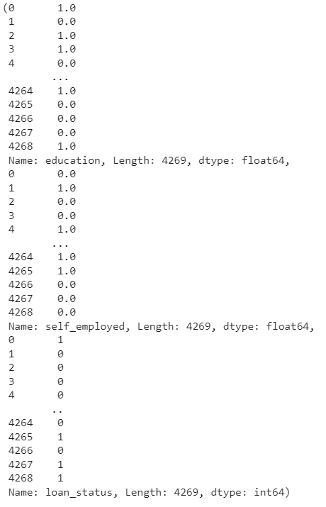

### Feature Selection

I performed feature selection to identify which variables would be most useful for building the model. To do this, I first used a **Pearson correlation heatmap** to examine the relationships between the features. The heatmap revealed that variables like **no_of_dependents, self_employed, and education showed very weak correlations with other features**. Given their low correlation, I considered removing these features to reduce potential noise and improve model performance. 

  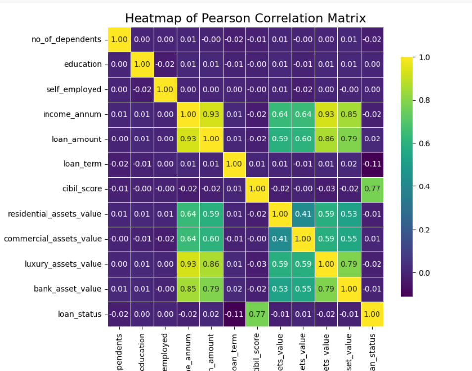

However, to be more certain about the impact of these features, I also performed a **Chi-square test** for statistical independence. This test showed that all three features **no_of_dependents, self_employed, and education had a p-value greater than 0.05**, which suggests that they are not significantly related to the target variable (loan approval). Based on this, I made the decision to **remove these features** from the dataset.

  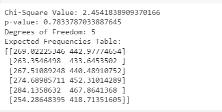
  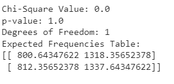
  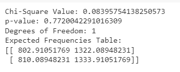

### Data Scaling

I proceeded with scaling the data to standardize the values, ensuring that all features contribute equally to the model.

  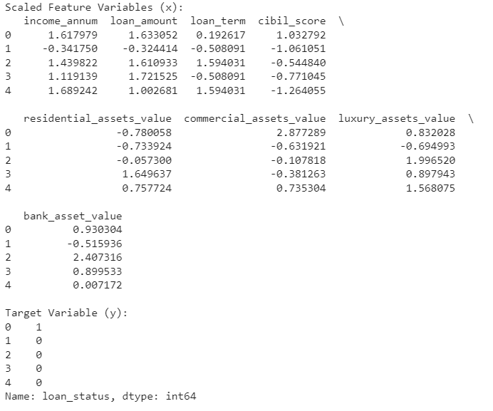

### Data Splitting

Finally, I split the dataset into three parts: **training (70%), validation (15%), and testing (15%)**.

## Build XGBoost Model

### Hyperparameter Tunning

#### The process started with setting the initial hyperparameters: n_estimators = 300, max_depth = 1, and learning_rate = 0.1. To optimize the model, I plotted the loss curves for different values of reg_lambda in order to identify the most suitable value for this hyperparameter.

  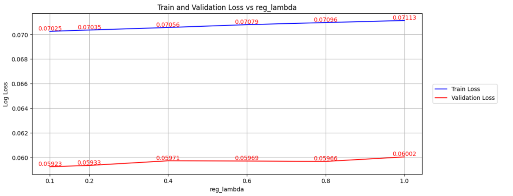

From the plot, it was observed that the training loss gradually increased and reached its lowest point at reg_lambda = 0.1. For the validation loss, it increased from 0.1 to 0.4, then decreased to 0.8, and finally increased again. The lowest loss was observed at reg_lambda = 0.1, so I decided to choose reg_lambda = 0.1 for further tuning of the model.

#### With the parameters n_estimators = 300, reg_lambda = 0.1, and learning_rate = 0.1, I then plotted the loss curves for different values of max_depth to find the optimal value for this parameter.

  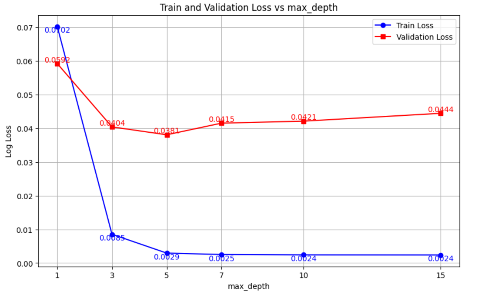

The results showed that for smaller values of max_depth (such as max_depth = 1), the training loss was high, indicating that the model was too simple to capture the patterns in the data. As max_depth increased to 3, the training loss decreased significantly. The loss continued to decrease and almost plateaued from max_depth = 5, showing that the model was learning effectively from the training data. For max_depth > 7, the training loss remained very low, indicating that the model had effectively learned the details of the training data.

For the validation loss, it decreased sharply from max_depth = 1 to 3, which indicated an improvement in the model's performance. This showed that increasing the depth helped the model learn better and reduced underfitting. At max_depth = 5, the validation loss reached its lowest point, indicating optimal performance on the validation set. When max_depth was increased beyond 5, the validation loss started increasing, showing signs of overfitting as the model began to memorize the training data and lost its ability to generalize. Therefore, max_depth = 5 was selected as the optimal depth for the model.

#### With n_estimators = 300, reg_lambda = 0.1, and max_depth = 5, I then plotted the loss curves for different values of learning_rate to select the most appropriate value for this parameter.

  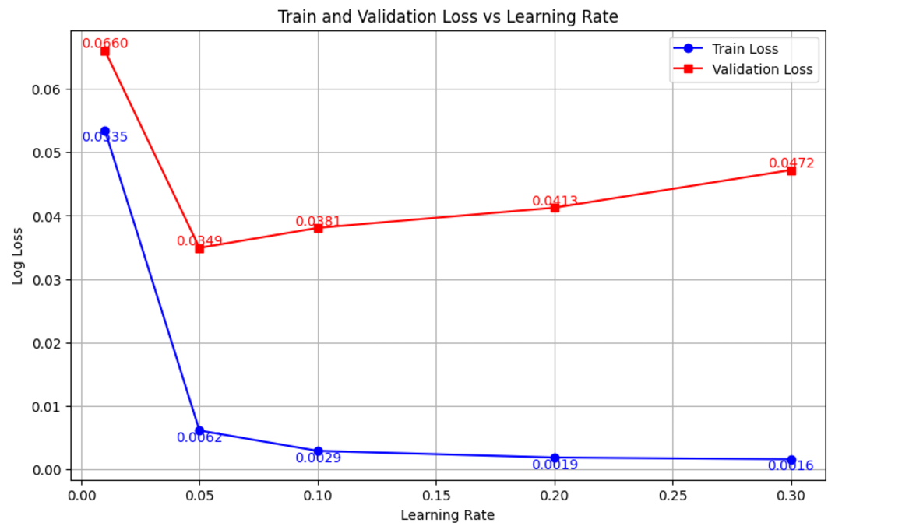

The plot showed that both training and validation losses decreased sharply from learning_rate = 0 to 0.05. As the learning rate continued to increase, the training loss continued to decrease, but the validation loss started to increase, indicating that the model was beginning to overfit. Therefore, I chose learning_rate = 0.05 to continue fine-tuning the model.

#### With the final hyperparameters set to reg_lambda = 0.1, max_depth = 5, and learning_rate = 0.05, I then plotted the loss curves for different values of n_estimators to determine the best value for this parameter.

  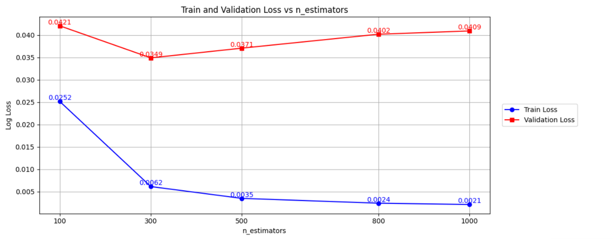

The plot showed that as n_estimators increased from 100 to 300, both training and validation losses decreased. However, when n_estimators was increased further, the training loss continued to decrease while the validation loss started to increase. Based on this, I selected n_estimators = 300 as the optimal value for the model.

After finding the optimal hyperparameters, I used n_estimators = 300, reg_lambda = 0.1, max_depth = 5, and learning_rate = 0.05 to train the model and evaluate its performance on the test set.

### Result

The plot showed that the training loss decreased consistently and quickly in the early epochs (epochs 0-50) before slowing down and converging at a very low value, indicating that the model had learned well from the training data. This suggests that the model was effectively adjusting its parameters to reduce errors on the training data.

  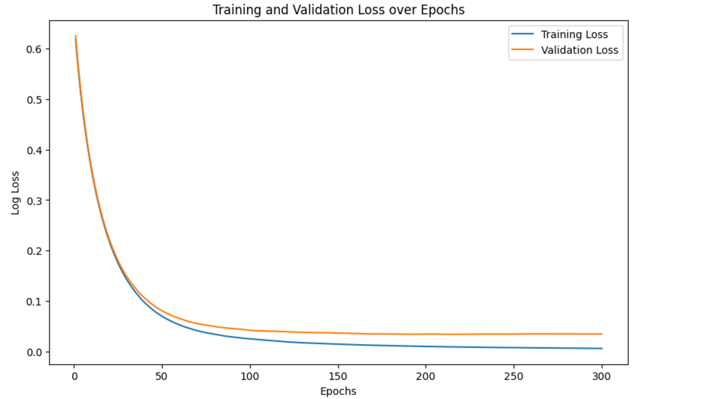

The validation loss followed a similar trend to the training loss and also converged at a very low value. The validation loss was not significantly higher than the training loss, which suggests that the model generalized well to the unseen data and did not suffer from overfitting.

When evaluated on the test set, the accuracy achieved is 98.13%. With this level of accuracy, the model is performing very well. This indicates that the model has learned the important features from the data without overfitting. This result meets the high accuracy requirement for classifying customers for loan approval.

The model's performance was further evaluated using the ROC curve and the area under the curve (AUC). The model has an AUC value close to 1, demonstrating excellent capability in classifying customers as eligible or not for a loan. The ROC curve is close to the top-left corner (high True Positive Rate and low False Positive Rate), indicating that the model is very effective at detecting true positives. At the same time, the number of false positives is very low, which helps minimize losses when approving loans for customers who are not financially eligible.

  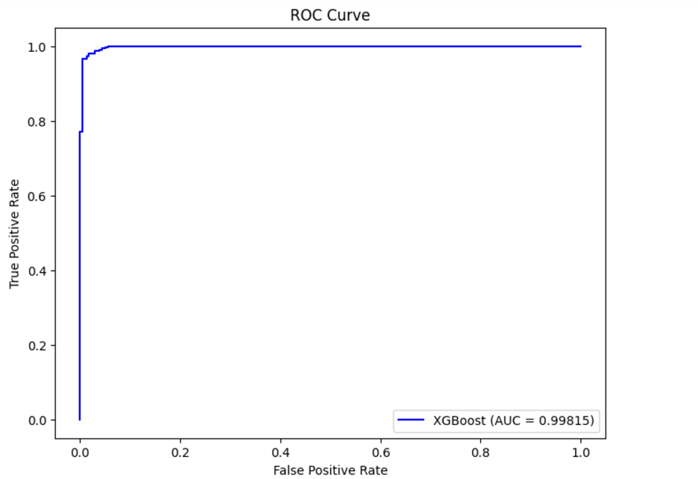

